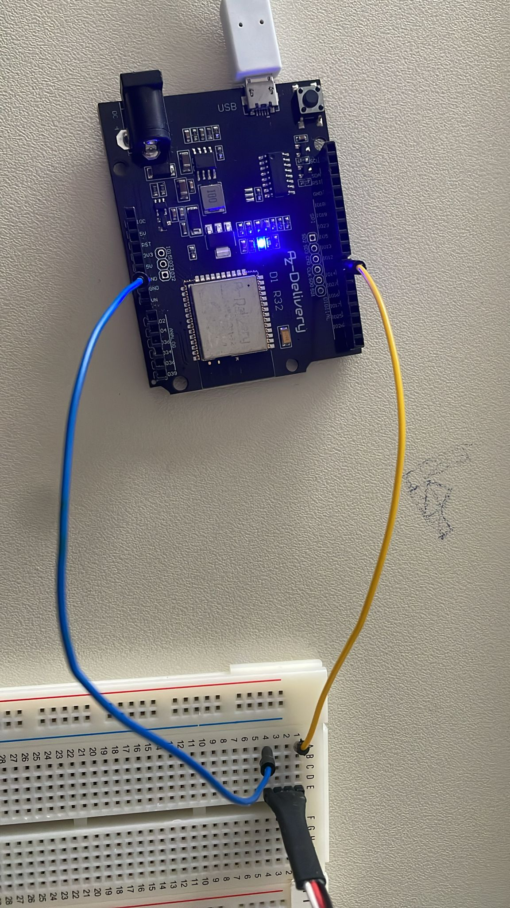
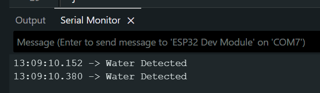

# Hardware Grundlagen aufbauen und Testen mit dem Taster

## 1. Mit real Aufbau mit dem Taster
Folgende Schaltung nachbauen:

Für mehr Informationen gehen Sie zu:
[../04_hardware/hardware_beschreibung](../04_hardware/hardware_beschreibung)
[../04_hardware/schaltkreisbeschreibung](../04_hardware/schaltkreisbeschreibung)

## 2. Testscript ausführen
Das Testskript dient zur Überprüfung, ob der Schalter korrekt eingebunden ist.

Das Skript aus folgendem Pfad kopieren:  
`/firmware/tests/readWater`

Das Skript in eine `.ino` Datei einfügen.  
Wichtig: Der Ordner muss **denselben Namen wie die `.ino` Datei** haben.  

Danach sollte der Output wennd er Schalter gedrückt wird so aussehen:
