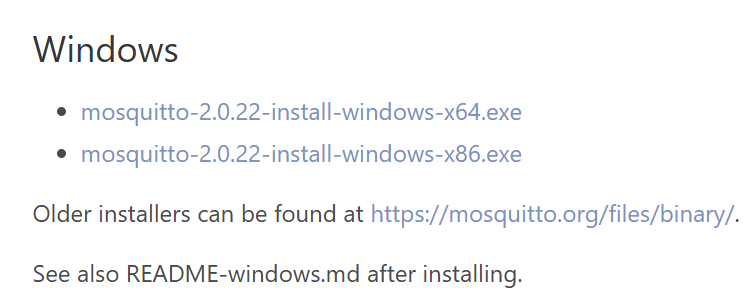
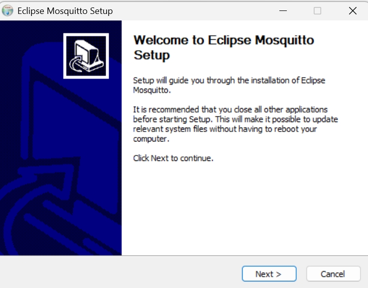

# MQTT-Verbindung mit ESP32
## 1. Mosquitto herunterladen
Link: https://mosquitto.org/download/


Danach das .exe File ausführen und die Anweißungen befolgen:


## 2. MQTT Config bearbeiten
Das Config-file befindet sich unter diesem Pfad:

`C:\Program Files\mosquitto`

Folgenden Text oben im File einfügen und speichern:
```
listener 1883 0.0.0.0
allow_anonymous true
```

Danach die Powershell öffnen und folgendes eingeben:
```
cd C:/"Program Files"/mosquitto
./mosquitto -c ./mosquitto.conf -v
```

Wenn kein Error kommt kann man in einem neuen Powershell Tab auf das Topic subscriben mit folgendem:
```
./mosquitto_sub -t water/topic
```

## 3. Testscript ausführen
Das Testskript dient zur Überprüfung, ob der Schalter korrekt eingebunden ist.

Das Skript aus folgendem Pfad kopieren:  
`/firmware/testMQTT/`

Das Skript in eine `.ino` Datei einfügen.  
Wichtig: Der Ordner muss **denselben Namen wie die `.ino` Datei** haben.  